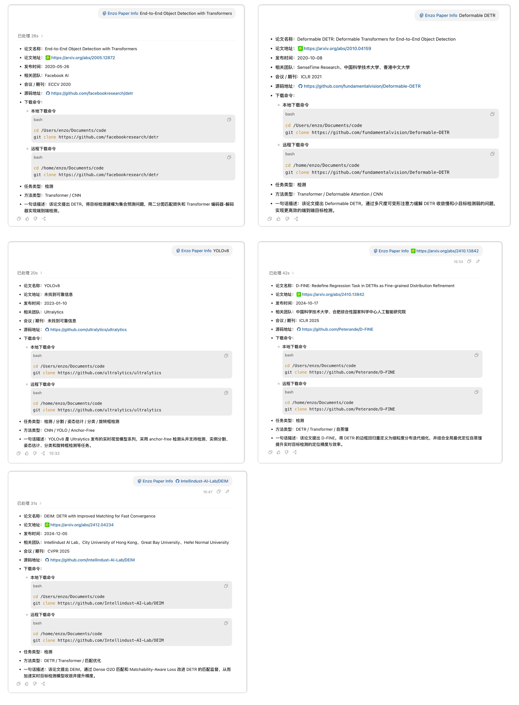

# enzo-paper-info

这是一个 Codex Skill 的教程示例。

## 1、功能说明

`enzo-paper-info` 是一个用于查询深度学习 / CV 领域论文或方法基础信息的 Codex Skill。

<br>

> 用户仅需在 Codex 对话中提供：论文标题 / 方法名 / 论文链接 / GitHub 地址  
> `enzo-paper-info` 会按如下固定字段返回该论文或方法的基本信息：
> ```markdown
> - 论文名称：
> - 论文地址：
> - 发布时间：
> - 相关团队：
> - 会议 / 期刊：
> - 源码地址：
> - 下载命令：
>     - 本地下载命令
>         ```bash
>         cd /Users/enzo/Documents/code
>         git clone <官方 GitHub 仓库地址>
>         ```
>     - 远程下载命令
>         ```bash
>         cd /home/enzo/Documents/code
>         git clone <官方 GitHub 仓库地址>
>         ```
> - 任务类型：
> - 方法类型：
> - 一句话描述：
> ```

<br>

示例：



## 2、安装

下载本仓库后，将其中的子文件夹 `skills/enzo-paper-info` 放到你的 Codex Skills 目录。一般 Codex Skills 目录为：`~/.codex/skills`。

```bash
# 下载本仓库
git clone https://github.com/Enzo-MiMan/enzo-paper-info.git

# 如果你本地还没有 ~/.codex/skills，请先创建一个
mkdir -p ~/.codex/skills

# 将 skills/enzo-paper-info 复制到你的 Codex Skills 目录下
cd enzo-paper-info
cp -R skills/enzo-paper-info ~/.codex/skills/
```

目标目录结构为：

```text
.codex/
  skills/
    enzo-paper-info/
      SKILL.md
```

注意：需要重启 Codex，才能发现 `enzo-paper-info` Skill。
